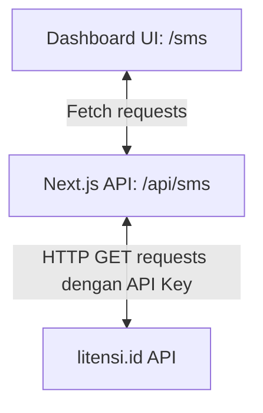

# Implementation Plan — SMS Activation Tool

Dokumen ini berisi rencana implementasi untuk Dashboard SMS Activation Tool yang terintegrasi di Next.js menggunakan API dari `litensi.id`.

## 1. Arsitektur Sistem

Untuk menghindari masalah CORS (Cross-Origin Resource Sharing) dan mengamankan API key di sisi server, kita akan membagi sistem menjadi dua bagian utama:
1. **API Proxy Route (`app/api/sms/route.ts`)**: Berperan sebagai jembatan yang menerima request dari client-side, menyisipkan API Key secara aman di server-side, meneruskan request ke upstream API `litensi.id`, dan mengembalikan respon ke client-side.
2. **Dashboard Client (`app/sms/page.tsx`)**: Antarmuka pengguna (UI) modern berbasis React Server/Client Component yang interaktif untuk memonitor balance, memesan nomor, menerima kode SMS, dan mengelola status aktivasi.

---

## 2. API Proxy Route (`app/api/sms/route.ts`)

Proxy akan mem-forward semua query parameters ke base URL:
`https://litensi.id/api/sms/handler_api.php`

### Parameter Query yang Didukung:
- `action`: Menentukan aksi (misal: `getBalance`, `getNumber`, `getStatus`, `setStatus`, dll.)
- `api_key` (Opsional): Jika dikirim dari client, gunakan. Jika tidak, gunakan default dari env `SMS_ACTIVATION_API_KEY` (fall back ke `FDsgdf9EKGJ3TqfuN6WAODoavHLf4lvz`).
- Parameter lainnya (`service`, `country`, `operator`, `id`, `status`, `maxPrice`, `fixedPrice`, `phoneException`, `start`, `limit`) akan di-forward secara otomatis.

---

## 3. Komponen Dashboard Client (`app/sms/page.tsx`)

Dashboard akan dibuat modern dengan layout ala SaaS Premium, menggunakan Tailwind CSS dan mendukung Dark Mode.

### Fitur Utama:
1. **Informasi Akun & API Key**:
   - Menampilkan saldo saat ini (dikonversi ke format Rupiah).
   - Tombol manual refresh saldo.
   - Input field untuk API Key kustom (prefilled dengan default).
2. **Formulir Pemesanan Nomor**:
   - Dropdown Negara (mengambil data dari `getCountries`, default Indonesia - ID 6).
   - Dropdown Layanan (mengambil data dari `getServicesList`, dengan shortcut cepat untuk WhatsApp, Telegram, Google).
   - Dropdown Operator (mengambil data dari `getOperators`, default `any`).
   - Input filter harga (`maxPrice`, `fixedPrice` checkbox) dan pengecualian prefix nomor (`phoneException`).
   - Tombol Order Number.
3. **Daftar Aktivasi Aktif (Active Activations)**:
   - Menampilkan daftar nomor aktif dari database provider (`getActiveActivations`).
   - Menampilkan status detail (Waiting, SMS Received, Finished, Canceled).
   - Jika status `Waiting for SMS` (1) atau `Waiting for Retry` (3), lakukan auto-polling `getStatus` setiap 5 detik.
   - Jika SMS berkode masuk, putar efek suara notifikasi singkat, tampilkan kode verifikasi dalam ukuran besar (Big Bold Text) dengan tombol Copy to Clipboard.
   - Tombol aksi per nomor:
     - **Minta SMS Lagi (Retry / Status 3)**
     - **Selesaikan Aktivasi (Finish / Status 6)**
     - **Batalkan Pemesanan (Cancel / Status 8)**
4. **Log & Debug Panel**:
   - Menampilkan riwayat respon API dan error dalam bentuk log box scrollable untuk memudahkan debugging.

---

## 4. Rencana Pengujian (Verification Plan)

### Otomatis & Build:
- Jalankan `npx tsc --noEmit` untuk memastikan tidak ada error pada tipe TypeScript.
- Jalankan `npm run lint` untuk memvalidasi style & aturan ESLint.
- Jalankan `npm run build` untuk memverifikasi proses build produksi Next.js.

### Manual:
1. Akses halaman `/sms` di browser lokal.
2. Periksa apakah saldo terisi dengan benar (misal: `Rp 100.000` atau sesuai saldo API key default).
3. Lakukan pemesanan nomor baru, lalu pastikan nomor tampil di daftar aktivasi aktif.
4. Uji alur status perubahan: coba batalkan nomor (Cancel) atau selesaikan nomor (Finish) dan amati perubahan respon.
